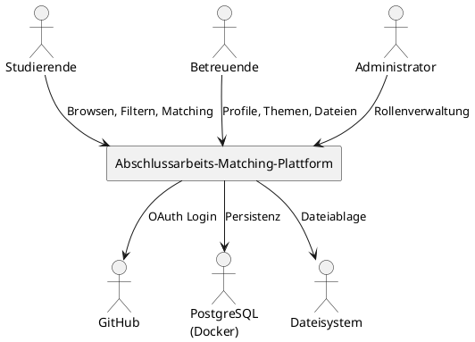
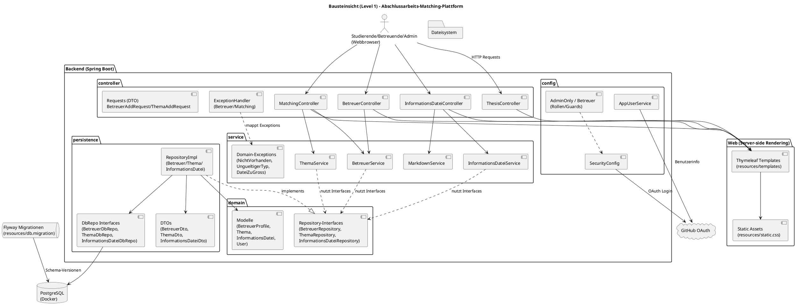

#  Einführung und Ziele
 
##  Aufgabenstellung und Motivation

Im Bachelor-Studium der Informatik stellt die Suche nach einer geeigneten Betreuungsperson für die Abschlussarbeit für viele Studierende eine erhebliche Herausforderung dar. Derzeit müssen Studierende potenzielle Betreuer:innen individuell kontaktieren oder die Webseiten einzelner Arbeitsgruppen nach möglichen Themen durchsuchen. Dieser Prozess ist zeitaufwendig und wenig transparent.

Zwar existiert eine zentrale Übersichtsseite der Arbeitsgruppen, jedoch bietet diese keine strukturierte Möglichkeit, Betreuende und Themen gezielt zu vergleichen oder anhand persönlicher Voraussetzungen zu filtern.

Ziel der zu entwickelnden Plattform ist es, Studierende bei der Suche nach einer passenden Betreuungsperson und einem geeigneten Abschlussarbeitsthema effizient zu unterstützen. Gleichzeitig sollen Betreuende entlastet werden, indem relevante Informationen zentral bereitgestellt und Anfragen besser vorqualifiziert werden. Die Plattform soll als zentrale Anlaufstelle dienen und den Prozess der Themen- und Betreuungssuche strukturieren und vereinfachen.

##  **Qualitätsziele**

Für die Architektur der Anwendung wurden folgende Qualitätsziele als besonders relevant identifiziert. Die Reihenfolge stellt eine Priorisierung dar.

### **Benutzbarkeit**

Die Anwendung soll für Studierende und Betreuende intuitiv und ohne Einarbeitungszeit nutzbar sein.

### **Erweiterbarkeit**

Die Architektur soll so gestaltet sein, dass zukünftige Erweiterungen (z. B. zusätzliche Matching-Kriterien oder neue Benutzerrollen) mit geringem Aufwand integriert werden können.

### **Wartbarkeit**

Der Code und die Systemstruktur sollen übersichtlich und modular aufgebaut sein, um Anpassungen und Fehlerbehebungen zu erleichtern.

### **Sicherheit**

Insbesondere hochgeladene Dateien sowie die Authentifizierung und Autorisierung der Nutzer:innen müssen sicher umgesetzt werden.

### **Zuverlässigkeit**

Die Anwendung soll stabil betrieben werden können und auch bei kurzfristigen Ausfällen keine inkonsistenten Zustände erzeugen.

###  **Stakeholder**

Die folgende Tabelle zeigt die wichtigsten Stakeholder der Anwendung sowie deren Erwartungen an das System.

Stakeholder	Erwartung an die Anwendung

Studierende: Schnelles und übersichtliches Finden von Betreuenden und Themen

Betreuende:	Reduzierung unpassender Anfragen und strukturierte Darstellung eigener Angebote

Administrator:innen:	Einfache Verwaltung von Rollen und Nutzer:innen

## Einschränkungen

Die folgenden Einschränkungen begrenzen die Entwurfs- und Implementierungsentscheidungen der Anwendung und sind bei der Architekturplanung zu berücksichtigen.

### **Technologische Einschränkungen**

Die Anwendung wird als Webanwendung umgesetzt.

Die Implementierung erfolgt in Java unter Verwendung des Spring-Frameworks.

Die Authentifizierung der Nutzer:innen erfolgt über GitHub (OAuth).

Für den Datenzugriff wird Spring Data JDBC eingesetzt.

Als Datenbank wird PostgreSQL verwendet.

Die Datenbank wird in einem Docker-Container betrieben.

### **Organisatorische Einschränkungen**

Die Entwicklung erfolgt im Rahmen eines Hochschulprojekts mit begrenzter Zeit und begrenzten personellen Ressourcen.

Architektur und Dokumentation orientieren sich am arc42-Template.

Änderungen an der Admin-Rolle dürfen keine Neukompilation der Anwendung erfordern, ein Neustart mit angepasster Konfigurationsdatei ist jedoch zulässig.

### **Fachliche und technische Randbedingungen**

Die maximale Größe hochgeladener Dateien beträgt 10 MB.

Zulässige Dateiformate sind PDF, ZIP und Markdown.

Markdown-Dateien dürfen HTML enthalten, die Verwendung des <script>-Tags ist jedoch untersagt. 

Studierende benötigen keine gesonderte Registrierung, sondern authentifizieren sich ausschließlich über GitHub.

Die Rolle „Betreuende“ wird zur Laufzeit durch Administrator:innen vergeben.

## Kontextabgrenzung

Dieses Kapitel beschreibt die Abgrenzung des Systems von seiner Umgebung sowie die externen Akteure und Systeme, mit denen die Anwendung interagiert. Ziel ist es, klar festzulegen, welche Funktionalitäten Teil des Systems sind und welche außerhalb liegen.

### Fachlicher Kontext

Die Anwendung richtet sich an drei primäre Benutzergruppen:

Studierende, die eine Betreuungsperson und ein passendes Thema für ihre Abschlussarbeit suchen

Betreuende, die Informationen über sich selbst, mögliche Themen sowie begleitende Materialien bereitstellen

Administrator:innen, die für die Vergabe von Rollen und die Systemkonfiguration verantwortlich sind

Studierende nutzen das System ausschließlich lesend, um Profile und Themen zu durchsuchen, zu filtern oder über ein Matching passende Vorschläge zu erhalten.
Betreuende pflegen ihre Profile, laden Dateien hoch, verwalten Themen und ergänzen weiterführende Informationen.
Administrator:innen verwalten Benutzerrollen und nehmen organisatorische Einstellungen vor.

### Technischer Kontext

Neben den Benutzergruppen interagiert das System mit mehreren externen technischen Systemen:

GitHub dient als externer Authentifizierungsanbieter (OAuth).

Eine PostgreSQL-Datenbank, betrieben in einem Docker-Container, wird zur persistenten Speicherung von Anwendungsdaten verwendet.

Die Anwendung wird über einen Webbrowser genutzt.

### 3.3 Kontextdiagramm

Das folgende Kontextdiagramm zeigt die Anwendung im Zusammenspiel mit externen Akteuren und Systemen.

## Bausteinsicht

Dieses Kapitel beschreibt die statische Struktur der Anwendung auf oberster Ebene (Level 1). Ziel ist es, einen Überblick über die wichtigsten Bausteine des Systems und deren Verantwortlichkeiten zu geben.

### Bausteindiagramm (Level 1)

Das folgende Diagramm zeigt die zentralen Komponenten der Anwendung und deren Beziehungen zueinander.

